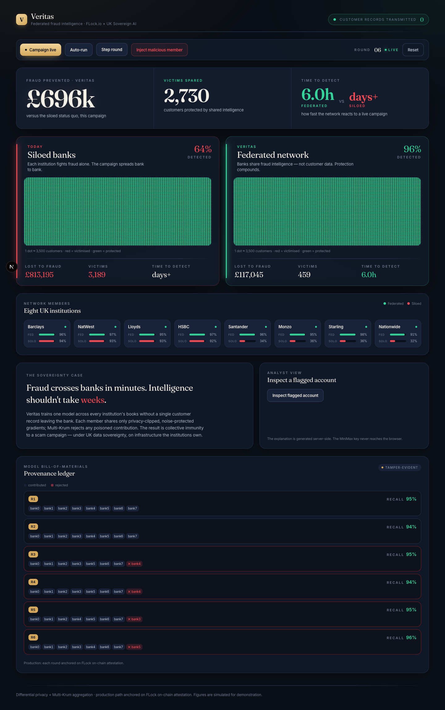
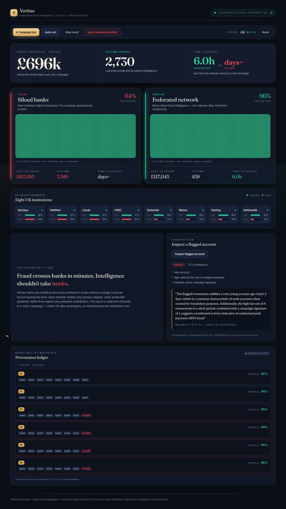

<!--
Render: `marp docs/deck.md -o deck.pdf` (or `--pptx` / `--html`).
Demo screenshots live in docs/demo-shots/. Speaker notes are in HTML comments.
Numbers here are measured live in the build — see docs/pitch.md "Hero numbers".
-->

# Veritas

### One bank detects, every bank is immunised — without a single customer record ever leaving the building.

**Federated fraud intelligence for UK banks.**
FLock.io × UK Sovereign AI

<!-- Open warm. The whole deck pays off one line: detect once, immunise everyone, move zero data. -->

---

## The problem: cross-bank fraud nobody can see whole

- **APP / mule fraud** — the "move your money to a safe account" scam — is one of the UK's largest fraud categories, hundreds of £M/year.
- Since **Oct 2024 the PSR mandates reimbursement**, split **50/50** between sending and receiving bank. Banks are now on the hook for *each other's* fraud.
- A mule campaign **opens accounts across many banks at once** — but no single bank sees the whole pattern. Each detects it alone, slowly.
- The data that would stop it — transactions, account behaviour, scam reports — **cannot legally be pooled** (GDPR, competition law).

<!-- This is a structural impossibility, not a tooling gap. Pooling is the one forbidden move. -->

---

## The insight: federation is the *only* architecture that fits

- Centralised AI can't solve this — it requires the one forbidden move (pooling).
- **Federated learning** inverts it: bring the model to the data, share only what the model *learns*, never the data itself.
- Each bank keeps ownership and custody; the *intelligence* is shared, the *data* is sovereign.
- A campaign learned at one member reaches every member **within hours, not days**.

> This isn't federation as a nice-to-have. It's the only design where the data stays legal *and* the network sees the whole pattern.

---

## What Veritas is: three tiers, data local at each

| Tier | Component | Sees | Sends upward |
|---|---|---|---|
| **0** | Edge SDK (device) | victim-side / scam-in-progress | DP, secure-aggregated updates |
| **1** | Bank Node (TEE enclave) | the bank's payment data (read-only) | DP-clipped model deltas + attestations |
| **2** | Control Plane (UK region) | only deltas + control messages | global model back down; provenance |

- Aggregation happens **twice** (hierarchical FL): device→bank, then bank→global.
- The trust boundary is crossed by **exactly three things, none of them customer data**.

<!-- "no customer data leaves" is enforced by construction, not by policy. -->

---

## The demo: two regimes, one screen

- Eight UK banks, one shared model. Badge: **`customerRecordsTransmitted: 0`**.
- **Left — siloed (today):** each bank blind to the others → stays **red**, fraud drains through mules at *other* banks.
- **Right — federated (Veritas):** one bank learns the mule signature → the round propagates it → the network **greens out** in hours.
- Same model, same code. The *only* difference is whether banks share what they learn.

<!-- Point at the badge first, then let the green wave overtake the red. That's the whole story in one screen. -->

---

## Technical depth: an ensemble + a graph, all federated

- **Stacked ensemble** (logistic + MLP + GRU + embeddings + GBDT → federated meta-learner), live and federated.
  - **0.761 recall vs 0.614 best-single** on heterogeneous fraud — the meta-learner *unions* each model's coverage.
- **GNN mule-graph benchmark** — mule rings are a graph problem, trained without moving records.
  - **siloed 0.51 → federated 0.81 recall (+56.9%)**.
- On a hidden cross-bank campaign: **federated 0.982 vs siloed 0.098** — the siloed bank is structurally blind.
- **Real data, not synthetic** — on the real ULB credit-card fraud dataset (284,807 tx, 0.17% fraud) partitioned non-IID across 5 banks: ensemble **AUPRC 0.844 → 0.884 federated**; the **fraud-poorest bank gains most (+0.066 AUPRC)** — a bank that can't learn fraud alone benefits the most from the pooled signal. *(Card fraud here; the APP/mule framing is the target typology.)*

<!-- Three independent results, all pointing the same way: federation beats siloed, every time. -->

---

## Privacy & security: defence in depth on every update

- **Differential privacy** — gradient clip + Gaussian noise on every update (RDP accountant reports the true ε).
- **Secure aggregation** — Bonawitz pairwise masking + **ZK norm-proofs (VSA)**: the plane sees only the aggregate, never one member's update, and proves each update is well-formed.
- **Multi-Krum robust aggregation** — rejects poisoned / Byzantine member updates before they touch the global model.
- **`customerRecordsTransmitted: 0`** — verifiable, not a slogan.

> Privacy (no record reconstructable) **and** robustness (no member can corrupt the model) — both, simultaneously.

---

## Governance & trust: verify us, don't trust us

- **Signed, append-only Merkle transparency log** + consistency proofs — every round's contributors, rejected members, and scores are tamper-evident.
- **Model bill-of-materials / provenance ledger** — who contributed, who was rejected, recall per round. "Verify" resolves against the Merkle root.
- **Live explanation** of a flagged mule — a "why" for the analyst, not just a score.
- Maps directly to the **AI Governance, Transparency & Trust** track.

<!-- The inspector + provenance ledger is the governance story made tangible. -->

---

## FLock usage — honest about what's real

- **Real `flock-sdk`.** Veritas subclasses the real `flock_sdk.FlockModel` (`train` / `evaluate` / `aggregate`) — forked from FLock's credit-card-fraud example and repurposed.
- **Live distributed federation:** a real control plane + independent node processes run real rounds — the siloed/federated race is genuine FL, not a mock.
- **Production-decentralisation path (named, not built here):** FLock's **FL Alliance** with provenance anchored **on-chain**, and FLock **sovereign inference** for explanations.
- This build runs the **permissioned, crypto-free** path (no wallet/token; Merkle log) — an *extra* adoption path on top of FLock decentralisation, never a replacement.

<!-- Lead FLock-native + on-chain. Crypto-free is enterprise hardening, introduced second. -->

---

## Sovereignty & why now

- **UK-owned, collectively-improving model** on infrastructure the institutions own. Nothing leaves any silo.
- **Why now:** PSR reimbursement (Oct 2024) made banks financially liable for each other's fraud — acute, budgeted demand to detect faster and find mule accounts early.
- **Defence in depth:** hardware attestation (TEE) *and* federated decentralisation — complementary, not either/or.
- The sovereign core is the federated model; every external dependency (explainer) is a pluggable swap to a sovereign endpoint.

---

## Adoption path: little-to-no bank engineering

- **Tier 1 = zero backend code.** Node ships as a sealed marketplace appliance in the bank's *own* tenancy; bank grants one read-only role, approves one outbound rule. Veritas authors the feature map *inside* their enclave; they review.
- **Tier 0 = one optional drop-in mobile SDK** — same pattern as existing fraud/analytics vendors.
- **Challenger-first GTM:** land app-first challengers → prove cross-bank lift → network effect pulls in incumbents (consume Veritas as one signal in their existing platform).
- **Targets (reachable now):** Cifas, UK Finance, Stop Scams UK, bank fraud teams, telco fraud desks.
- **The ask:** 15-minute call → "yes, we'd pilot this."

---

## Veritas: one bank detects, every bank is immunised

| Metric | Federated (Veritas) | Siloed (today) |
|---|---|---|
| Detection rate | **0.955** | 0.637 |
| Victims | 2,029 | 3,189 |
| Lost | £517k | £813k |
| Time to detect | **~6 hours** | ~101 hours (days) |
| Fraud prevented | **£295,800** | — |
| Customer records transmitted | **0** | n/a |

**1,160 fewer victims. ~£296k prevented. Hours, not days. Zero records moved.**
UK-controlled · privacy-preserving · poisoning-resistant · provenance-anchored. **Thank you.**

<!-- Land the table, then the one-liner. Stop talking. -->
